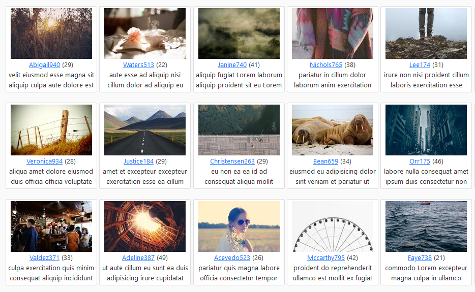
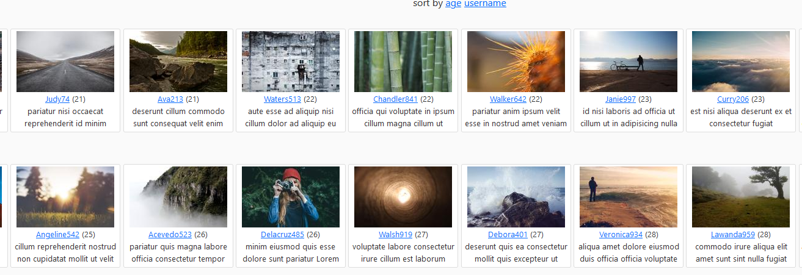

# User tiles
  
## Viewing the project
The project can be viewed by calling
```
  python manage.py runserver
```
then by visiting http://127.0.0.1:8000/ 

## Sorting by name and age
  
  Sort created by using simple url path
